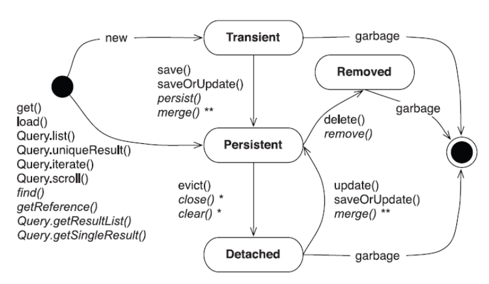
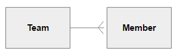
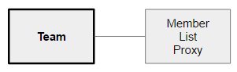
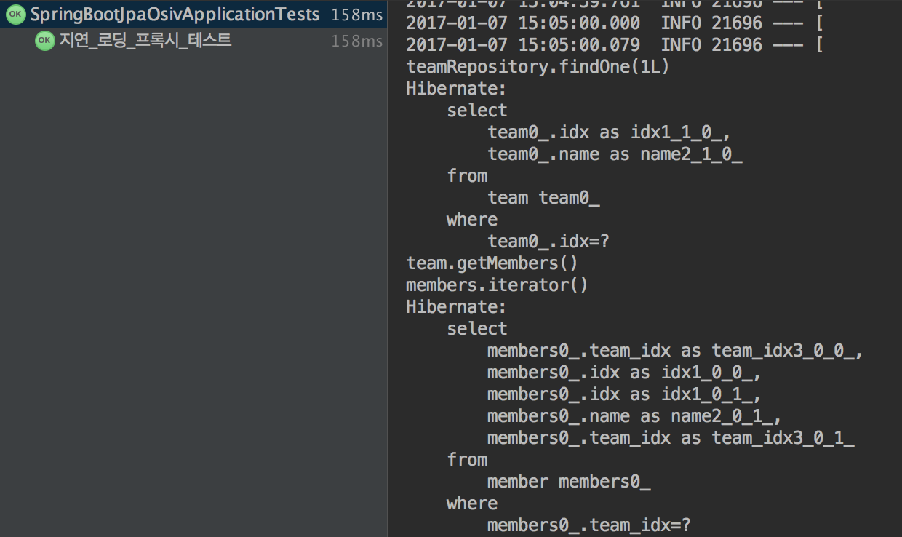
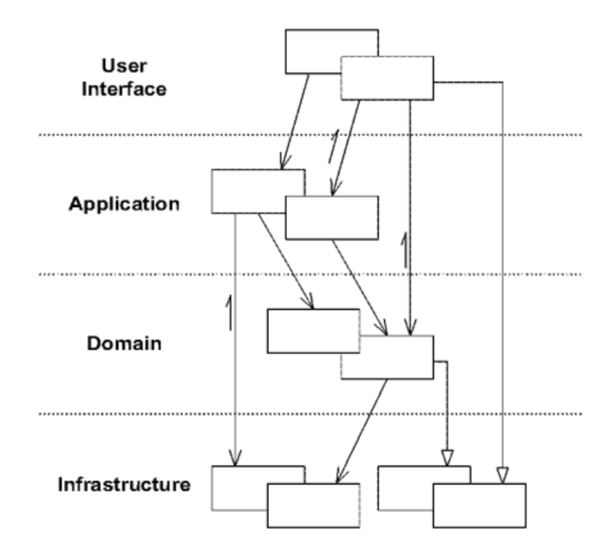
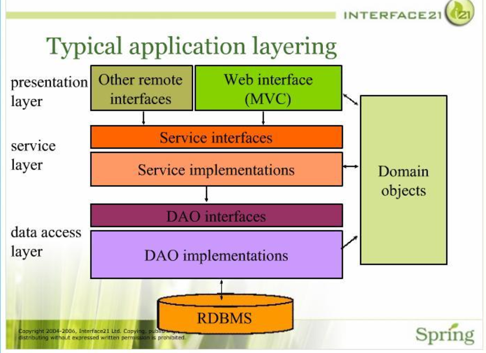
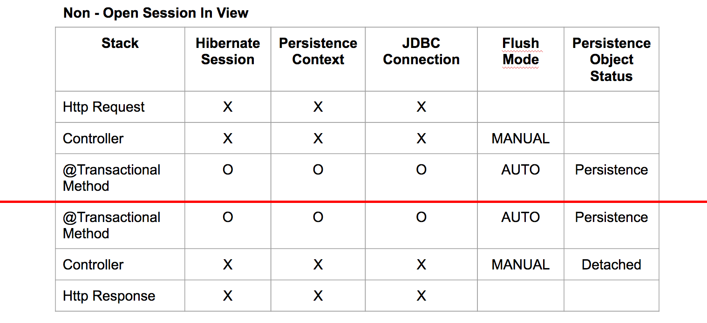
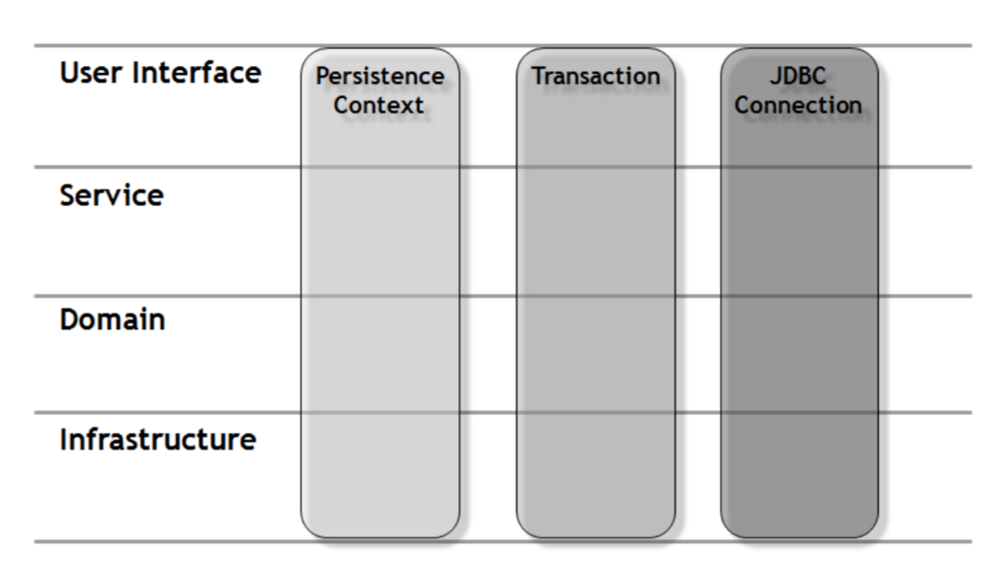
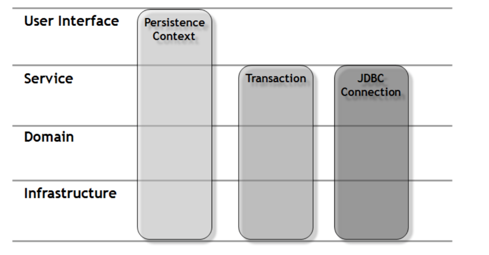
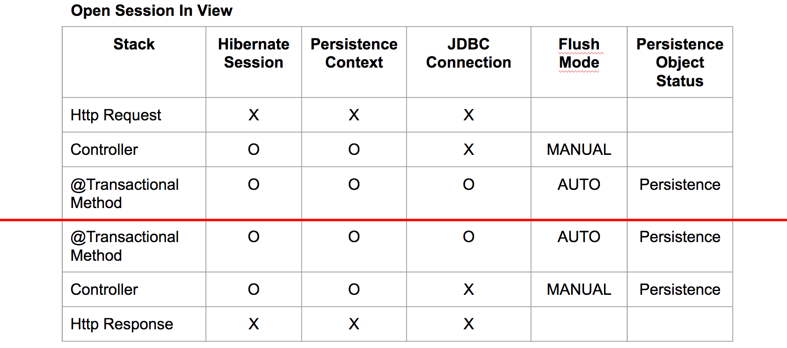

Spring - Open Session In View
=============================

Spring에서 ORM을 사용하여 개발을 하며, `Transaction`을 이해할 때 쯔음 닥쳐온 혼란이 있습니다.

지인에게 자신있게 `Transaction`을 설명해주기 위해 Spring Boot로 빠르게 어플리케이션을 올렸고

```java
@GetMapping("/member/{memberIdx}")
public String member(@PathVariable Long memberIdx, Model model) {
    Member member = memberRepository.findOne(memberIdx);

    model.addAttribute("name", member.getName());
    model.addAttribute("team", model.getTeam().getName());

    return "index";
}
```

`Transaction`이 끝난 상태에서 `Team`을 조회하니까 `LazyInitializationException`이 발생할꺼야!

하는 순간 페이지가 정상적으로 노출되는 당황스러운 순간이,,!


---

본 내용은 [Open Session In View Pattern](http://pds19.egloos.com/pds/201106/28/18/Open_Session_In_View_Pattern.pdf)의 내용을 기반으로 내용을 정리하였습니다.(본 내용을 이해하는데 `레이어 아키텍쳐`를 알면 더 이해가 빠를 수 있습니다.)

이번 포스팅에서는 `Spring Boot`에서 `Default`로 설정해주고 있는 `Open Session In View Pattern`에 대하여 설명해보도록 하겠습니다.

해당 패턴은 객체-관계 매핑(ORM, Object-Relational Mapping)의 사용으로 등장하게 된 패턴이며, 예제를 구성하는데에 JPA(Java Persistence API)의 구현체 프레임워크인 Hibernate를 사용할 것 입니다.

시작 전 `Open Session In View`에 대해 미리 정리를 하자면, `Open Session In View`는 `영속성 컨텍스트를 뷰 렌더링이 끝나는 시점까지 개방한 상태로 유지하는 것`입니다.

아래 내용으로

-	먼저 몇 가지 알아야 할 내용을 먼저 설명하겠습니다.
-	그리고 어떤 이유로 이러한 패턴이 등장하게 되었는지를 예제로 살펴볼 것이고,
-	과거에는 어떻게 해결하였는지를 볼 것이며,
-	Spring Boot에서는 무엇을 해주고 있는지 알아보겠습니다.

영속성 컨텍스트
---------------

Hibernate는 도메인 레이어 객체들이 하부의 데이터 저장소와 영속성 메커니즘에 대해 알지 않아도 되는 `투명한 영속성(transparent persistence)`을 제공하는 `비침투적인(nonintrusive)` 프레임워크입니다.

영속성과 관련된 모든 관심사는 도메인 객체로부터 격리된 채 관리자 객체에 의해 투명하게 처리되는데, 이 관리자 객체의 기능을 담당하는 객체가 Hibernate의 `Session 객체`이며, `Session 객체`는 `영속성 컨텍스트`를 포함합니다.

영속성 컨텍스트를 이해하기 위해서는 `Transaction`을 이해해야 합니다. `Transaction`는 쪼갤 수 없는 업무처리의 단위로 작업의 원자 단위라고 보면 되며, 영속성 컨텍스트는 `Transaction`과 1:1로 연결됩니다.

하나의 `Transaction`동안 수정된 객체의 모든 상태는 영속성 컨텍스트 내에 저장되어, `Transaction`이 종료될 때 데이터 저장소에 동기화(flushing)됩니다. 따라서 하이버네이트 Session을 하나의 작업 단위 동안 생성 및 조회, 수정, 삭제되는 객체의 상태를 보관하는 일종의 캐시로 간주해도 무방합니다.(실제로 하이버네이트 Session을 “1 차 캐시”라고 부르기도 합니다)

> MemberService.Java

```java
@Transactional
public void moveTeam(Long memberIdx, Team team){
    Member member = memberRepository.findOne(memberIdx);
    member.moveTeam(team);
}
```

위 moveTeam 메서드가 실행될 때 @Transactional 어노테이션에 의해 자동으로 Session이 열리게 됩니다.

조회(findOne)를 통해 가져온 Member 객체는 영속성 콘텍스트에 캐쉬되고, `Transaction`동안 Member 객체의 변경 사항이 추적됩니다. 이 때 Member 객체는 영속성으 갖는다고 말합니다.

moveTeam에 의해 영속성을 갖는 Member 객체가 변경된 것을 영속성 컨텍스트가 감지하게 됩니다. `Transaction`이 종료되는 시점인 메서드 종료 시점에 영속성 컨텍스트가 캐시하고 있는 객체의 변경 상태를 저장소와 동기화하게 되며, 이때 update 쿼리가 자동으로 실행되게 됩니다.

영속성을 갖는 객체의 상태
-------------------------

영속성을 갖는 객체는

-	Persistence
-	Detached
-	Transient
-	Removed

위 4 가지 상태를 가집니다.



[출처 : 하이버네이트 완벽 가이드]

**Persistence**

데이터베이스 식별자(주키)를 가지며 작업 단위 내에서 영속성에 의해 관리되는 상태

> Transaction 안에서 조회, 저장, 수정 등을 통해 가져온 영속성이 부여된 상태를 Persistence 상태라 하며, Transient 상태의 객체도 강제로 Persistence 상태로 전환시킬 수 있습니다.

**Detached**

데이터베이스 식별자를 가지지만 영속성 컨텍스트로부터 분리되어 더 이상 데이터베이스와의 동기화가 보장되지 않는 상태

> Session.close() 메소드는 Session 을 닫고 영속성 컨텍스트를 포함핚 모든 자원을 반환하며, 관리하에 있는 모든 영속 인스턴스를 Detached 상태로 변경시킵니다. 하이버네이트는 Detached 상태의 객체에 대해서는 변경사항을 추적하지 않으며, 따라서 데이터베이스와의 동기화 또한 수행하지 않습니다.

**Transient**

아무 상태도 가지지 않는 상태(무 상태를 정의하기 위한 상태)

> new 연산자를 사용하여 생성한 객체는 곧바로 Persistence 상태가 되지 않고 Transient 상태를 갖게 됩니다.

**Removed**

제거될 상태

> Transaction이 종료되는 시점에 삭제될 객체는 Removed 상태를 갖습니다.

지연 로딩(Lazy Loading)
-----------------------

Open Session In View Pattern의 등장을 설명하기 앞서 중요한 개념이 `지연 로딩(Lazy Loading)`입니다.

그리고 `지연 로딩`을 설명하기 앞서 알아야 할 것이 JPA의 `페치 전략`과 `프록시`의 개념입니다.

**페치 전략**

페치 전략이란 **쿼리 수행과 관련된 객체와 연관 관계를 맺고 있는 객체나 컬렉션** 을 어느 시점에서 가져올지에 대한 전략 입니다. 즉 데이터베이스에서 데이터를 가져 오는 전략을 정의합니다.

JPA에서 정의하는 전략은 두 가지가 있습니다.

`EAGER` - 데이터를 즉시 가져오는 전략으로 `즉시 로딩`이라고 합니다.

`LAZY` - 데이터가 처음 액세스 될 때 가져오는 전략으로 `지연 로딩`이라고 합니다.

JPA에서는 연관관계의 종류에 따라서 기본으로 갖는 페치 전략을 다르게 가지고 있습니다.

-	즉시로딩(EAGER)

	-	`@ManyToOne`
	-	`@OneToOne`

-	지연로딩

	-	`@OneToMany`
	-	`@ManyToMany`

`프록시` 객체는 주로 연관된 데이터를 `지연로딩`할 때 사용됩니다.

**프록시**

`지연 페치` 전략에 따라 연관 관계를 맺고 있는 객체와 컬렉션에는 실제 ENTITY 대신 실제 객체처럼 위장한 `프록시(Proxy)` 객체가 생성됩니다.

프록시는 실제 객체의 참조를 보관하는데, 실제 클래스를 기반으로 만들어 지므로 실제 객체와 유사합니다. 실제 엔티티의 데이터에 접근할 때 영속성 컨텍스트에 엔티티가 생성되어 있지 않으면 영속성 컨텍스트에 객체 생성을 요청하게 됩니다. 이를 `프록시 초기화`라 하고 처음 사용될 때 **한번만** 초기화됩니다. 초기화되면 프록시를 통해 실제 엔티티에 접근 가능하게 됩니다.

아래는 1:N 관계를 갖는 Team과 Member입니다.



Team 도메인은 Member와 `@OneToMany`의 관계를 맺고 있습니다.

```java
@Entity
public class Team {
    @Id
    @GeneratedValue
    private Long idx;

    @Column(nullable = false, length = 20)
    private String name;

    @OneToMany(mappedBy="team")
    private List<Member> members;
```

JPA의 기본 Select를 통하여 Team을 조회하였을 때, 연관관계를 맺고 있는 members List 객체는 지연페치의 대상이되어, Proxy 객체로 채워질 것 입니다.



`@OneToMany`의 Default는 LAZY이기 때문에 Team 객체를 통해 Member List를 사용하려고 할 때 `Fetch`가 되어 쿼리가 실행되게 됩니다.

```java
team.getMembers().iterator()
```

*getMembers를 통해 객체를 호출해왔을 때가 아닌 내부의 값을 호출할 때 Fetch된다는 것!*

```java
@Test
@Transactional
public void 지연_로딩_프록시_테스트() throws Exception {
    System.out.println("teamRepository.findOne(1L)");
    Team team = teamRepository.findOne(1L);
    System.out.println("team.getMembers()");
    List<Member> members = team.getMembers();
    System.out.println("members.iterator()");
    members.iterator();
}
```

위와 같은 테스트 코드를 작성해보면 더욱 확실하게 알 수 있습니다.



최초 `Team` 객체를 호출시 연관관계의 `Member`들을 호출하지 않는 지연 로딩이 잘 적용되고 있습니다.

`team.getMembers` Method로 연관관계 객체를 가져오는 시점이 아닌 `members.iterator`를 통해 프록시 객체의 데이터에 접근할 때 프록시 객체의 초기화가 이루어지며 지연 로딩이 성공적으로 동작하는 것을 볼 수 있습니다.

Open Session In View Pattern의 등장
-----------------------------------



일반적인 엔터프라이즈 애플리케이션의 레이어 구성 <Br>[출처: Domain-Driven Design]

레이어의 명칭이나 개수는 문헌에 따라 약간의 차이가 있지만 대부분의 애플리케이션은 `사용자 화면을 구성하는 사용자 인터페이스 레이어(User Interface Layer)`, `애플리케이션의 제어 흐름을 관리하는 애플리케이션 레이어(Application Layer)`, `도메인의 핵심 로직을 포함하는 도메인 레이어(Domain Layer)`, `상위 계층을 지원하기 위한 인프라스트럭처 레이어(Infrastructure Layer)`로 구성됩니다.

일반적인 엔터프라이즈 애플리케이션의 레이어 구성을 스프링 레이어와 매칭해보자면(개념적으로 다르지만),



-	`User Inteface Layer`는 `Paresentiation Layer`
-	`Application Layer`는 `Service Layer`
-	`Infrastructure Layer`는 `Persistence Layer`\(`Data access Layer`\)

로 매칭될 수 있습니다.

다음과 같은 원칙에 따라 레이어가 분리되며,

-	모델-뷰 분리(Model-View Separation)[Fowler PEAA, Larman AUP]

-	깔끔하고 얇은 뷰(Clean and Thin View)[Johnson J2EEDD]

-	영속성 분리(PI, Persistence Ignorance)[Nilsson ADDD]

-	도메인 레이어 고립(Domain Layer Isolation)[Evans DDD]

이 때 `서비스 레이어`는 `애플리케이션`의 `트랜잭션` 경계를 정의하는 역할을 하게 되고, 이로인해 발생하는 문제가 `Open Session In View Pattern`을 등장하게 했습니다.

```java
//Controller
@GetMapping("")
public String home(Model model){
    model.addAttribute("teams", teamService.findAll());
    return "home";
}

//Service
@Transactional
public List<Team> findAll(){
    return teamRepository.findAll();
}
```

`View Layer`에서 연관 객체를 사용하려 할 때 발생하는 `LazyInitializationException`!

```java
org.hibernate.LazyInitializationException: failed to lazily initialize a collection of role: com.kingbbode.model.Team.members, could not initialize proxy - no Session
```

`Exception`이 발생한 이유를 아래 그림으로 살펴보겠습니다.



`findAll` 메서드가 종료될 때 `Transaction`이 종료되며, `Transaction`의 종료로 `JDBC Connection`이 `disconnect`되고, `Hibernate Session`이 종료되며, 영속 객체는 `Detaced` 상태로 변경됩니다. 즉 `Service Layer`에서 관리되는 `Transaction`이 View Layer로 넘어가면서 종료되었기 때문에 발생하는 문제인 것 입니다.

이 문제는 많은 개발자들에게 불편함을 주게되었고, 문제점을 해결하기 위해서 등장한 방법들이 있습니다.

### 뷰 렌더링에 필요한 객체 그래프를 모두 로드

```
뷰에서 필요로 하는 모든 연관 관계의 객체를 `EAGER Fetch`로 설정하거나, Join 쿼리를 작성하는 방법입니다.
```

그러나 REPOSITORY의 재사용성 감소 및 복잡성 증가를 야기하는 방법이며, 뷰와 영속성 관심사의 강한 결합(뷰를 수정하면, 모델도 변경해야 하는)은 관심사의 분리 원칙을 위반하게 됩니다.

### POJO FACADE 패턴

```
애플리케이션 레이어 안에서 새로운 객체를 통해 프록시를 초기화한 후 사용자 인터페이스로 반한하는 방법입니다.
```

POJO FACADE 패턴은 뷰에 대한 관심사를 애플리케이션 레이어의 흐름 관리와 관련된 관심사와 혼합하는 것 입니다. 비록 SERVICE와 독립된 별도의 Pojo 객체에 프록시 초기화 로직을 위치시킨다고 해도 애플리케이션 레이어 개발시에 렌더링될 뷰에 대한 존재와 렌더링과 관련된 요구사항을 고려해야 합니다.

POJO FACADE 패턴의 가장 적절한 용도는 분산 환경에서 원격 통신을 지원하기 위한 REMOTE FACADE[Fowler PEAA]로 사용하는 것 입니다. 분산 환경이 아닌 단일 JVM 상에서 뷰를 렌더링하기 위한 객체 그래프를 전달하는 경우에는 POJO FACADE 를 사용하는 것을 권하지 않습니다.

---

*뷰 렌더링에 필요한 객체 그래프를 모두 로드하는 방식은 많은 단점이 존재하며, POJO FACADE 패턴은 분산 환경에 적합하다는 결론입니다. 그리고 등장한 것이 `Open Session In View 패턴` 입니다*

---

### Open Session In View 패턴

```
뷰 렌더링 시점에 영속성 컨텍스트가 존재하지 않기 때문에 Detached 객체의 프록시를 초기화할 수 없다면 영속성 컨텍스트를 오픈된 채로 뷰 렌더링 시점까지 유지하자는 것 입니다. 즉, 작업 단위를 요청 시작 시점부터 뷰 렌더링 완료 시점까지로 확장하는 것 입니다.
```

`Open Session In View` 패턴에 대한 많은 논쟁들이 있었지만, 결론은 `Open Session In View` 패턴은 레이어 아키텍처를 해치는 안티패턴이 아니라는 것 입니다.

이 내용에 대한 자세히 알고 싶다면 꼭 참조한 문서를 읽어보시길 바랍니다.

#### 전통적인 Open Session In View 패턴

전통적인 `Open Session In View` 패턴은 서블릿 필터 시작 시에 하이버네이트 `Session` 을 열고 트랜잭션을 시작합니다.

이후 서블릿 필터는 컨트롤러에 요청을 위임하고 뷰 렌더링이 모두 완료된 후에 트랜잭션을 커밋 또는 롤백합니다. 일반적으로 플러시 모드 기본값인 `FlushMode.AUTO` 를 사용하므로 영속성 컨텍스트에서 관리하고 있는 모든 `Persistent` 상태의 객체는 뷰의 렌더링이 모두 완료되고 서블릿 필터에서 트랜잭션을 커밋하는 순간 데이터베이스로 플러시됩니다.

또한 `ConnectionReleaseMode` 의 기본값인 `AFTER_TRANSACTION` 에 따라 JDBC 커넥션의 반환 역시 시점 역시 뷰가 모두 렌더링되고 서블릿 필터 내에서 트랜잭션이 커밋(또는 롤백)되는 시점에 이루어지게 됩니다.



그러나 서블릿 필터 방식의 `Open Session In View` 패턴에는 JDBC 커넥션은 뷰의 렌더링이 모두 완료된 후에야 커넥션 풀로 반환되는 `JDBC 커넥션 보유 시간 증가`라는 단점과 , 뷰까지 트랜잭션이 확장될 수 있는 `모호한 트랜잭션 경계`라는 큰 단점이 있습니다.

#### Spring의 Open Session In View 패턴

Spring 프레임워크에서는 `FlushMode` 와 `ConnectionReleaseMode`의 조정을 통해 전통적인 서블릿 필터의 단점을 보완핚 `OpenSessionInViewFilter` 와 `OpenSessionInViewInterceptor` 를 제공합니다.

두 클래스의 가장 큰 특징은 기존 처럼 뷰에서 지연 로딩을 가능하게 하는 동시에 서비스 레이어에 트랜잭션 경계를 선언할 수 있다는 점 입니다.

서블릿 필터에서 `Session`을 오픈하고 트랜잭션을 시작하던 전통적인 방식의 `Open Session In View` 패턴과 달리 SpringMVC 에서 제공하는 `OpenSessionInViewFilter` 는 필터 내에서 `Session`을 오픈하지만 트랜잭션은 시작하지 않습니다.



Stack으로 살펴보면,



`Transaction`이 종료된 후에도 `Controller`의 `Session`이 `close`되지 않았기 때문에, 영속 객체는 `Persistence` 상태를 유지할 수 있으며, `Session`이 열려있고 `Persistence` 상태이기 때문에 프록시 객체에 대한 `Lazy Loading`을 수행할 수 있게 됩니다.

또한 `Flush Mode`가 `Manual로` 변경되었기 때문에, 뷰 단에서의 영속 객체의 상태 변화는 `Flush`되지 않고 유지될 수 있습니다.

**즉 Open Session In View 패턴을 적용한다면, 이전의 `LazyInitializationException` 문제는 발생하지 않게 됩니다.**

#### Open Session In View In Spring Boot

```
그런데 나는 Boot로 어플리케이션을 올렸을 뿐이고, Open Session In View 패턴을 적용한 적이 없었는데?
```

스프링 Boot `Application.properties` [Docs](https://docs.spring.io/spring-boot/docs/current/reference/html/common-application-properties.html)를 읽어보면, 알 수 있습니다.

```
# JPA (JpaBaseConfiguration, HibernateJpaAutoConfiguration)

...

spring.jpa.open-in-view=true # Register OpenEntityManagerInViewInterceptor. Binds a JPA EntityManager to the thread for the entire processing of the request.

...

```

스프링 Boot에서는 `Open Session In View 패턴`을 OpenEntityManagerInViewInterceptor를 통해 default로 지원을 해주고 있습니다.

spring.jpa.open-in-view를 바꿔가며 테스트해본다면 명확하게 알 수 있을 것 입니다.

[예제 GitHub](https://github.com/kingbbode/spring-boot-jpa-osiv)

---

### 마무리

`Spring Boot`를 사용하면서 Boot가 제공해주는 수많은 자동 설정은 우리에게 많은 편리함을 느끼게 합니다. **그러나 이 편리함 뒤에는 개발자에게 치명적인 함정이 있습니다.**

`Spring Boot`에서 지원해주는 `default` 설정들은 사실 이전에는 개발자들이 직접 작성해줘야 했던 설정이기 때문입니다. 저는 서블릿이 등장하고, 프레임워크가 등장하면서 겪었던 함정과 같다고 생각하고 있습니다.

`어느 하나도 자동으로 해주는 것은 없다`고 생각합니다. 모든 것이 언젠가 누군가 겪었을 불편함을 편하게 만들어준 것일 뿐이지 않을까요?!

모든 것이 대해서 다 알 순 없지만, 적어도 이렇게라도 하나씩 더 많이 알아갈 수 있도록 노력해야겠습니다.
