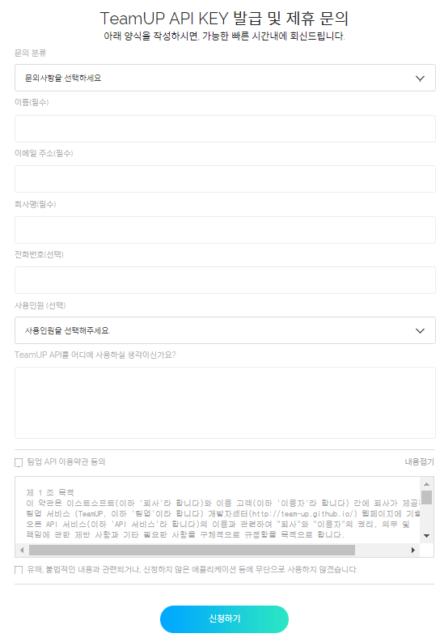

TEAMUP BOT 만들기 (Spring Boot)
-------------------------------

팀업 소개는 나중에....

이스트소프트의 기업용 메신저 [팀업(TeamUP)](http://tmup.com)은

-	사내 메신저
-	프로젝트별 그룹피드(게시판)
-	문서 등 자료 중앙관리
-	대용량 파일 전송

등 다양한 업무 도구를 제공해 빠른 커뮤니케이션(소통)을 통한 업무 효율을 향상시켜주는 기업용 통합 커뮤니케이션 플랫폼입니다.

[](https://tmup.com/)

시작해보겠다~~

---

준비
====

[팀업 Developer Center](https://tmup.com/main/developer)로 접속하여 API Key 신청합니다!  


신청이 승인되어 `client_id`와 `client_secret`을 발급받으면 모든 준비 완료!

이제 스트링 부트로 TeamUP 연동 봇을 만들어보겠습니다.

Spring Boot 기반 개발 시작!
===========================

스프링 부트 간략 설명~어쩌구.

Dependency
----------

> build.gradle

```
compile('org.springframework.boot:spring-boot-starter-web')
compile('org.springframework.security.oauth:spring-security-oauth2:2.0.8.RELEASE')
```

-	**spring-boot-starter-web**
	-	내장 톰켓과 RESTful 등 웹서버를 구축하기 위한 기본 의존성을 제공
-	**spring-security-oauth2**
	-	TeamUP의 Oauth2 Token을 쉽게 사용하기위해 사용

Configuration
-------------

### Properties

API를 사용하기 위해 먼저 발급받은 `client id`,`client_secret`과 봇과 연동될 `팀업 계정 정보`를 properties에 적어줍니다.<br> 사용할 TeamUP API도 명세해줍니다.

> src/main/resources/properties/bot.properties

```java
bot.event.url=https://ev.tmup.com/v3/events
bot.event.message.read.url=https://edge.tmup.com/v3/messages/
bot.event.message.send.url=https://edge.tmup.com/v3/message/
bot.event.feed.write.url=https://edge.tmup.com/v3/feed/
bot.oauth.token.url=https://auth.tmup.com/oauth2/token
bot.oauth.client.id={{발급받은 id}}
bot.oauth.client.secret={{발급받은 secret}}
bot.teamup.id={{봇과 연동될 팀업 계정 ID}}
bot.teamup.pw={{봇과 연동될 팀업 계정 비밀번호}}
```

<br> @Configuration을 사용하여 properties를 셋팅합니다.

> src/main/java/com.teamup.bot/config/TeamUpConfiguration.java

```java
@Configuration
@PropertySource(
        ignoreResourceNotFound = true,
        value = {
                "classpath:/properties/bot.properties"
                ,"file:/data/etc/teamup-bot/bot.properties"
        }
)
public class TeamUpConfiguration {
}
```

사용하는 각 서비스단에서 @Value 어노테이션을 사용하여도 괜찬지만, 통합하여 관리하기 위하여 저는 Component를 하나 만들었습니다.

> src/main/java/com.teamup.bot/properties/TeamUpProperties.java

```java
@Component
public class TeamUpProperties {
    @Value("${bot.event.message.read.url}")
    private String readUrl;

    @Value("${bot.event.message.send.url}")
    private String sendUrl;

    @Value("${bot.event.feed.write.url}")
    private String feedWriteUrl;

    @Value("${bot.event.url}")
    String eventUrl;

    @Value("${bot.oauth.token.url}")
    String tokenUrl;

    @Value("${bot.oauth.client.id}")
    private String clientId;

    @Value("${bot.oauth.client.secret}")
    private String clientSecret;

    @Value("${bot.teamup.id}")
    private String name;

    @Value("${bot.teamup.pw}")
    private String password;

    ...
}
```

### RestTemplate

API 통신을 위한 `RestTemplate Bean`을 생성합니다. RestTemplate를 두 개 생성한 이유와 `eventRestOperations`의 ReadTimeout이 30초인 이유는 아래에 RealTime Message Event에 설명하겠습니다!

> src/main/java/com.teamup.bot/config/ApplicationConfig.java

```java
@Configuration
public class ApplicationConfig {

    @Bean(name = "messageRestOperations")
    @Primary
    public RestOperations messageRestOperations() {
        HttpComponentsClientHttpRequestFactory factory = new HttpComponentsClientHttpRequestFactory();
        factory.setConnectTimeout(1000);
        factory.setReadTimeout(1000);
        return getRestOperations(factory);
    }

    @Bean(name = "eventRestOperations")
    public RestOperations eventRestOperations() {
        HttpComponentsClientHttpRequestFactory factory = new HttpComponentsClientHttpRequestFactory();
        factory.setConnectTimeout(1000);
        factory.setReadTimeout(30000);
        return getRestOperations(factory);
    }

    private RestOperations getRestOperations(HttpComponentsClientHttpRequestFactory factory) {
        RestTemplate restTemplate = new RestTemplate(factory);

        StringHttpMessageConverter stringMessageConverter = new StringHttpMessageConverter(Charset.forName("UTF-8"));
        MappingJackson2HttpMessageConverter jackson2Converter = new MappingJackson2HttpMessageConverter();
        ByteArrayHttpMessageConverter byteArrayHttpMessageConverter = new ByteArrayHttpMessageConverter();
        FormHttpMessageConverter formHttpMessageConverter = new FormHttpMessageConverter();
        formHttpMessageConverter.setCharset(Charset.forName("UTF-8"));

        List<HttpMessageConverter<?>> converters = new ArrayList<>();
        converters.add(jackson2Converter);
        converters.add(stringMessageConverter);
        converters.add(byteArrayHttpMessageConverter);
        converters.add(formHttpMessageConverter);

        restTemplate.setMessageConverters(converters);
        return restTemplate;
    }

    ...
}
```

여기까지 했다면 기본 Configuration 끝!

Oauth2 인증
-----------

TeamUp API는 Oauth2 Token 기반이며, Oauth2를 제외한 모든 API 기능은 Access 토큰을 필요로하고 있습니다. 이제 토큰을 발급받아보겠습니다.

`Oauth2Template`는 TeamUp API와 Auth 통신을 하는 Template 구현체 입니다.

> src/main/java/com.teamup.bot/teamup/templates/template/Oauth2Template.java

```java
@Component
public class Oauth2Template  {
    @Autowired
    @Qualifier(value = "messageRestOperations")
    private RestOperations restOperations;

    @Autowired
    private TeamUpProperties teamUpProperties;

    public OAuth2AccessToken token(OAuth2AccessToken accessToken){
        if (accessToken == null) {
            return post(accessToken, GrantType.PASSWORD);
        }else{
            if (accessToken.isExpired()) {
                return refresh(accessToken);
            }
        }
        return accessToken;
    }

    private OAuth2AccessToken refresh(OAuth2AccessToken accessToken) {
        return post(accessToken, GrantType.REFRESH);
    }

    private OAuth2AccessToken post(OAuth2AccessToken accessToken, GrantType grantType) {
        ResponseEntity<OAuth2AccessToken> response = restOperations.postForEntity(environmentProperties.getTokenUrl(), getEntity(accessToken, grantType),
                OAuth2AccessToken.class);

        if (response.getStatusCode().equals(HttpStatus.OK)) {
            accessToken = response.getBody();
        }

        return accessToken;
    }


    private HttpEntity<Object> getEntity(OAuth2AccessToken oAuth2AccessToken, GrantType grantType) {
        HttpHeaders header = new HttpHeaders();
        header.setContentType(MediaType.APPLICATION_FORM_URLENCODED);
        MultiValueMap<String, Object> data = new LinkedMultiValueMap<>();
        data.add("grant_type", grantType.getKey());

        if (GrantType.PASSWORD.equals(grantType)) {
            data.add("client_id", teamUpProperties.getClientId());
            data.add("client_secret", teamUpProperties.getClientSecret());
            data.add("username", teamUpProperties.getName());
            data.add("password", teamUpProperties.getPassword());
        } else if (GrantType.REFRESH.equals(grantType)) {
            data.add("refresh_token", oAuth2AccessToken.getRefreshToken().getValue());
        }
        return new HttpEntity<>(data, header);
    }
}
```

`spring-security-oauth2`의 `OAuth2AccessToken`을 이용하여 간편하게 만료를 확인하고 갱신을 해주고 있습니다!

다음은 Oauth2 Token을 보관, 관리하는 `TokenManager`입니다. getAccessToken()이 실행될 때마다 `Oauth2Template`의 token()을 호출하여, 없다면 생성, 만료되었다면 갱신한 토큰을 전달해 주게됩니다.

> src/main/java/com.teamup.bot/teamup/TokenManager.java

```java
@Component
public class TokenManager {

    private OAuth2AccessToken accessToken;

    @Autowired
    Oauth2Template oauth2Template;

    @PostConstruct
    void init(){
        accessToken = oauth2Template.token(accessToken);
    }

    public String getAccessToken() {
        accessToken = oauth2Template.token(accessToken);
        return accessToken.getValue();
    }
}
```

RealTime Message Event
----------------------

Meesage Read
------------
